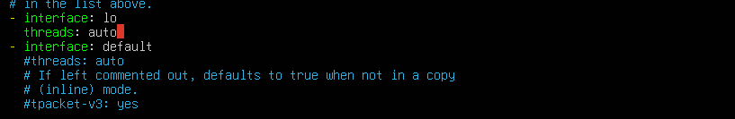
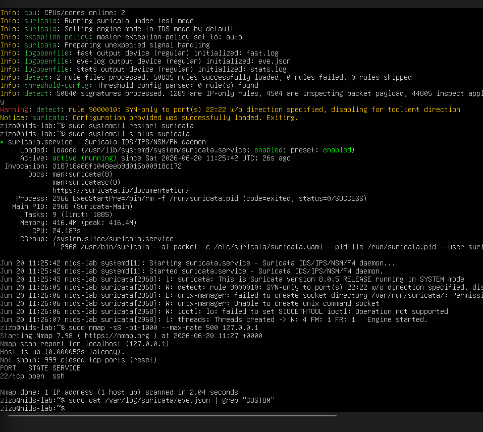
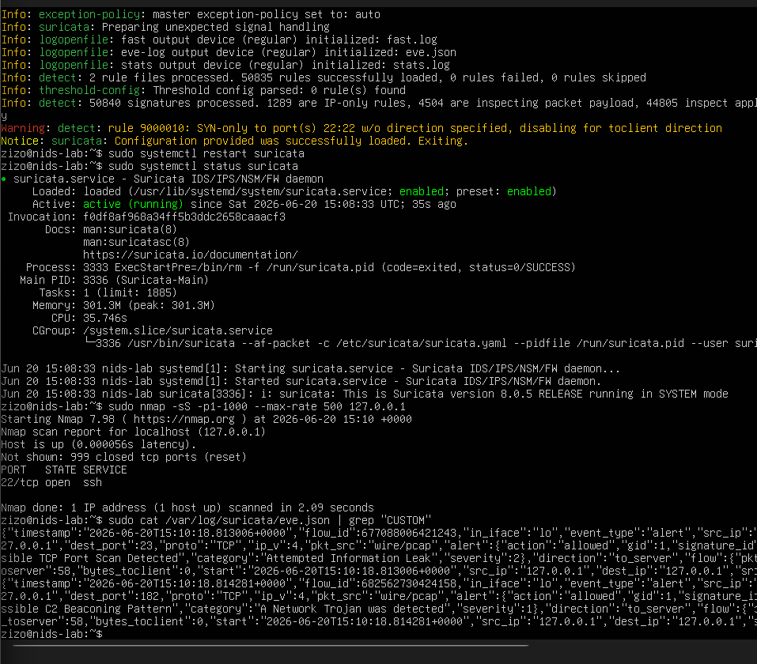
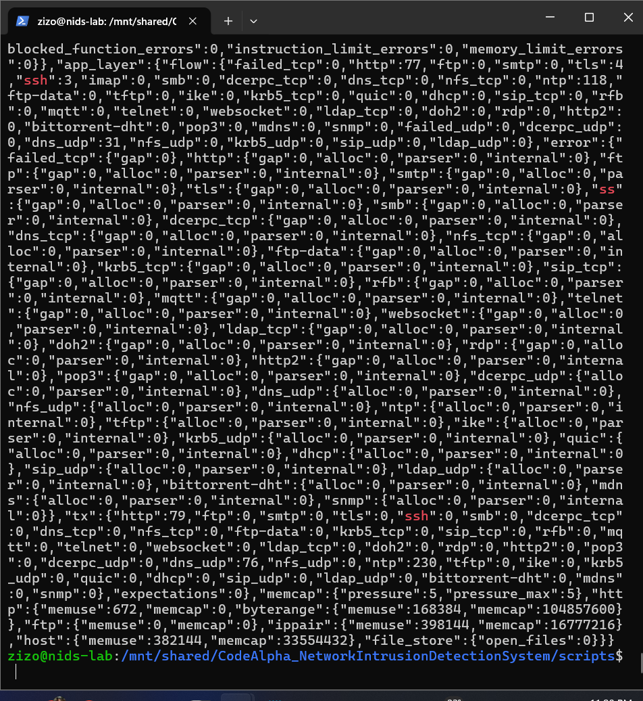
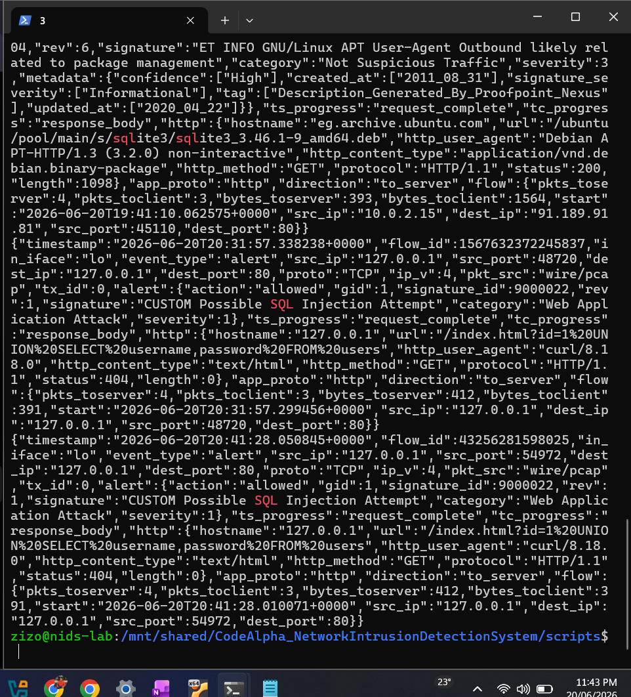
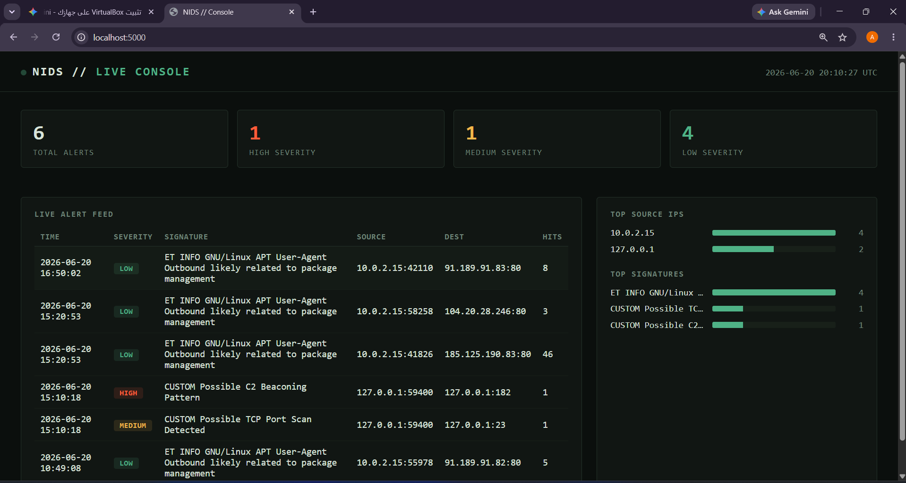
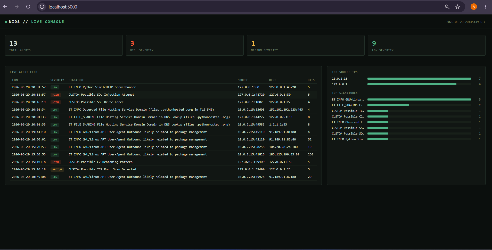

# Project Screenshots

This folder documents the working system end-to-end — from configuration validation through to
live detections on the dashboard.

### 01 — Suricata configuration loaded successfully

`suricata -T` test mode confirming the YAML config (custom rules, interfaces, HOME_NET) parses
and loads without errors.

### 02 — Suricata service running

`systemctl status suricata` showing the engine active and running as a system service, with
threads created on both the physical interface and loopback.

### 03 — Port Scan + C2 Beaconing detections

Output of an Nmap SYN scan replayed against the lab host, showing both the
**Possible TCP Port Scan Detected** and **Possible C2 Beaconing Pattern** custom rules firing in
`eve.json`.

### 04 — SSH Brute Force detection

Repeated SYN packets sent to port 22 (simulating brute-force connection attempts), correctly
flagged by the **CUSTOM Possible SSH Brute Force** rule.

### 05 — SQL Injection detection

A crafted HTTP request containing a UNION-based SQL injection payload, caught by the
**CUSTOM Possible SQL Injection Attempt** rule.

### 06 — Live dashboard overview

The Flask dashboard showing the live alert feed, severity breakdown, and top source IPs pulled
from the SQLite alert database.

### 07 — Final dashboard with all four custom detections

All four custom rules confirmed firing together: Port Scan, SSH Brute Force, SQL Injection, and
C2 Beaconing — alongside default Suricata ruleset alerts for context.
